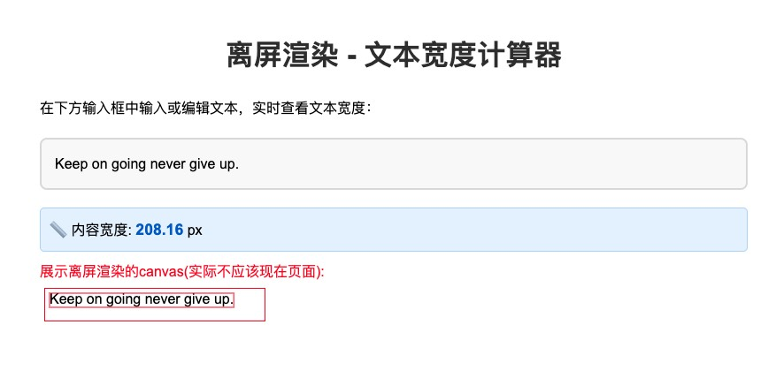

# off-screen-render
离屏渲染

## 样式参数

### FontStyle 接口

| 参数名 | 类型 | 必需 | 默认值 | 说明 |
|--------|------|------|--------|------|
| `size` | `number` | ✅ | - | 字体大小（pt） |
| `bold` | `boolean` | ❌ | `false` | 是否加粗 |
| `horizontal` | `"left" \| "center" \| "right"` | ✅ | - | 水平对齐方式 |
| `vertical` | `"top" \| "center" \| "bottom"` | ✅ | - | 垂直对齐方式 |
| `color` | `string` | ✅ | - | 字体颜色（CSS 颜色值） |
| `family` | `string` | ✅ | - | 字体族名 |
| `lineHeight` | `number` | ❌ | - | 行高倍数 |
| `italic` | `boolean` | ❌ | `false` | 是否斜体 |
| `underline` | `boolean` | ❌ | `false` | 是否下划线 |

### 使用示例

```javascript
const fontStyle = {
    size: 16,
    bold: true,
    horizontal: "center",
    vertical: "middle",
    color: "#333333",
    family: "Arial",
    lineHeight: 1.5,
    italic: false,
    underline: false
};
```


